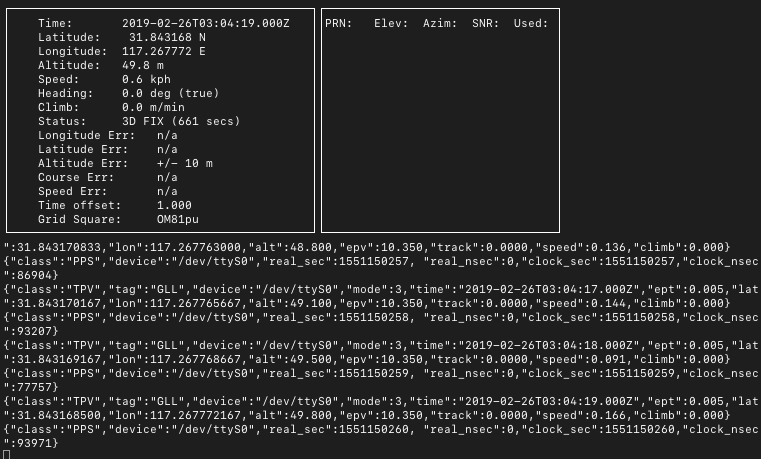
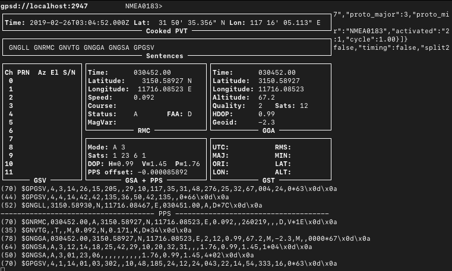

## [原创] 用GPS模块建立高精度ntp服务器

本文原创：**中国科学技术大学 张焕杰**

修改时间：2019.02.26

# 一、GPS对时简单原理

GPS卫星有精密时钟源，GPS模块依靠接收到信号时间差来计算位置，同时GPS模块可以通过以下两种方式对外输出时间信息：

一是通过串口输出NMEA语句，如下的北斗格式（GPS格式，前面是$GPRMC）输出：

```
$GNRMC,015022.00,A,3150.59184,N,11716.04078,E,0.242,,260219,,,D,V*12
```

其中的015022是时间01:50:22（UTC时间，对应的北京时间是09:50:22），260219是2019年2月26日。

但是这种输出，由于串口工作在9600BPS速率，误差比较大，

二是通过引脚 1PPS，信号的上升沿表示每秒钟的开始。1PPS信号的精度比较高，在10-30ns。

结合以上两种方式，可以从GPS模块得到高精度的时钟信号。

# 二、GPS模块的选择

如果是连接PC机使用，建议选择RS232信号电平的模块，如果连接树莓派机器使用，可以使用TTL信号电平的模块。

绝大部分GPS模块，引出了电源、地、RX、TX四根线，而并未将1PPS信号引出。用作ntp时，可以让商家断开RX信号，引出1PPS信号。

我是从taobao 深圳北天通讯 购买的GPS/北斗双模BS-70DU接收器。其中USB口用来给模块供电，RS232口用来通信。

特别注意：购买时与店主沟通，让店主断开RX信号，将1PPS信号连接到DB9的1口，即DCD信号。

模块如下：


# 三、服务器的安装

我本来计划使用atom处理的小盒子做ntp服务器，测试时发现无法成功，可能与atom处理的CPU自动降频有关。

后来找了一台比较老的服务器，顺利完成。

## 3.1 安装OS和软件

我使用的是CentOS 7，安装系统后，运行以下命令安装需要的软件：

```
yum install -y epel-release
yum install -y ntp pps-tools gpsd gpsd-clients
```

## 3.2 gpsd设置

gpsd是用来读取GPS模块信息，并将信息放到一段共享内存，供ntpd之类的其他应用使用。

编辑 `/etc/sysconfig/gpsd`，修改为（GPS模块接在COM1，也就是ttysS0）
```
# Options for gpsd, including serial devices
OPTIONS="-n /dev/ttyS0"
# Set to 'true' to add USB devices automatically via udev
USBAUTO="true"
```
设置gpsd启动：
```
systemctl start gpsd
systemctl enable gpsd
```
这时执行`cgps`或`gpsmon`可以看到信息，分别如下图所示，其中有位置信息、PPS信息，说明GPS模块工作征程：





## 3.3 ntpd设置

CentOS 7默认的是chronyd，我还是使用相对熟悉的ntpd。

编辑文件`/etc/ntp.conf`,增加如下内容：
```
server 127.127.28.0 
fudge 127.127.28.0 refid GPS

server 127.127.28.1 prefer
fudge 127.127.28.1 refid PPS
```
这里的127.127.28.0和127.127.28.1是虚拟设备，含义是获取gpsd放到共享内存中的信息来对时。


设置ntpd启动，并放开防火墙：
```
systemctl stop chronyd
systemctl disable chronyd
systemctl start ntpd
systemctl enable ntpd
firewall-cmd --add-service=ntp --permanent
firewall-cmd --reload
```
如果执行这些命令时，系统的时间大致正确，过10来分钟，执行`ntpstat`看到如下输出，说明工作正常：
```
synchronised to UHF radio at stratum 1 
   time correct to within 1 ms
   polling server every 64 s
```

此时，从其他计算机，执行 ntpdate ntp服务器IP地址，可以完成对操作。

如果想监视ntp服务器的运行状况，可以参考 https://www.satsignal.eu/ntp/NTPandMRTG.html


***
欢迎 [加入我们整理资料](https://github.com/bg6cq/ITTS)
